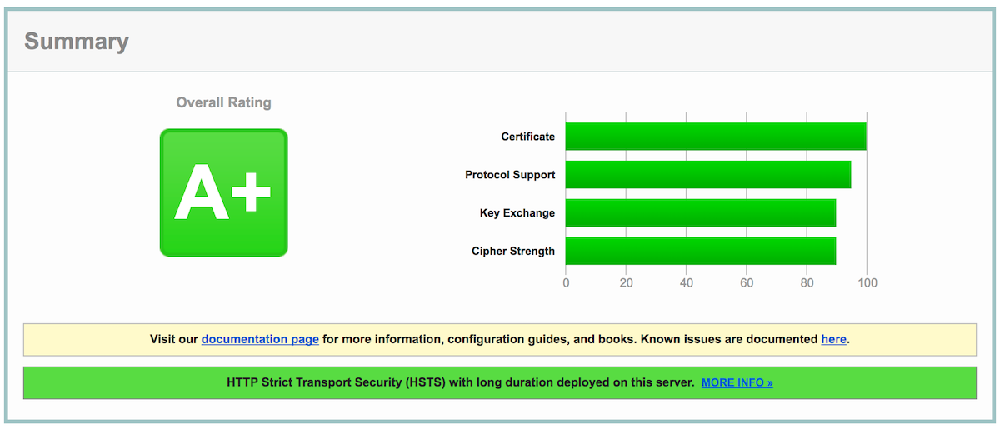
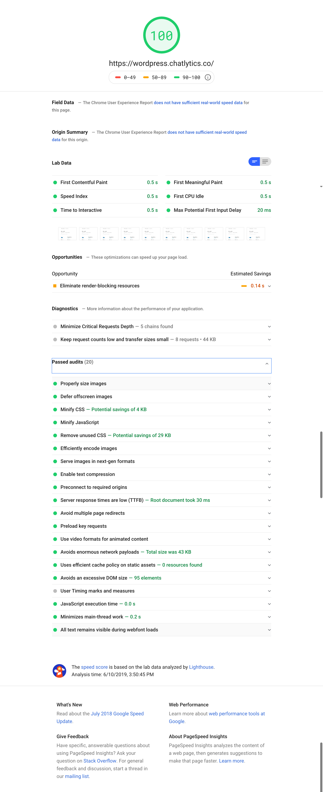
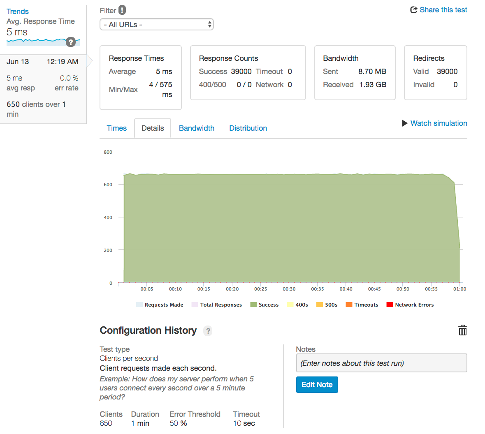

# NGINX Accelerated including Reverse Proxy, Redis, CDN, Lets Encrypt and much more!
This is a Docker image creates a high performance, optimized image for NGINX. Deliver sites and applications with performance, reliability, security, and scale. This NGINX server offers advanced performance, web and mobile acceleration, security controls, application monitoring, and management.

## Features

The image includes configuration enhancements for;
* Reverse Proxy
* SEO optimizations
* Customizable configurations
* SSL with support for Lets Encrypt SSL certificates
* Mime-type based caching
* Redis LRU cache
* Fastcgi cache
* Proxy cache
* tmpfs file cache
* Brotli and Gzip compression
* Redirects for moved content
* [Security & Bot Protection](https://github.com/mitchellkrogza/nginx-ultimate-bad-bot-blocker)
* Monitoring processes, ports, permissions... with Monit
* Standardized UID/GID and Permissions (www-data)
* Support GeoIP
* Rate limited connections to slow down attackers
* CDN support
* Cache purge
* Pair with [high performance PHP-FPM container](https://hub.docker.com/r/openbridge/ob_php-fpm/) for [blazing fast Wordpress installs](https://github.com/openbridge/wordpress)

There are many, many other benefits to this system. Give it a try!

# Getting Started


## Install
The first step is to build or pull the image:

### Build
```docker
docker build --build-arg "NGINX_VERSION=1.15.5" -t openbridge/nginx .
```
Replace `NGINX_VERSION=1.17.0` with your preferred version. You can also simply `pull` the images. See below.
### Pull
```docker
docker pull openbridge/nginx:latest
```

You can also use a different version of NGINX simply by pulling a build with the NGINX version you want. For example;
```docker
docker pull openbridge/nginx:latest
docker pull openbridge/nginx:1.15.4
docker pull openbridge/nginx:1.15.3
```
To see the available versions vist https://hub.docker.com/r/openbridge/nginx/tags/


## Running

Via Docker compose
```
docker-compose up -d
```
Using a named yml file:
```
docker-compose -f ./compose/html.yml up -d --remove-orphans
```

There are a sample HTML compose file at  `./compose/html.yml` as well as PHP one `./compose/php.yml` to get you started.

# Understanding Configurations
Please note that the config files inside the `/conf/*` directory are opinionated. They are the working examples of a specific implementation of preferences and needs.

We provided two pre-built configurations. The first one is for `html` based sites within `/conf/html/*` and another one is for `php` sites within `/conf/php/*`. The application will look for a config directory to use that. This is done with the `NGINX_CONFIG` ENV variable. For example, if you are running a html-based site and want to use the `/conf/html/*` configuration, then set `NGINX_CONFIG=html`. If you are running php and want to use the `/conf/php/*` configuration, then set `NGINX_CONFIG=php`. If you have a custom config set like `/conf/<my-custom-config>/*` then set `NGINX_CONFIG=my-custom-config`.

The nginx default setup located inside `/conf/basic/*`. Basic allows you to run nginx in a bare metal setup. Just set `NGINX_CONFIG=basic`

## Digging Into The `ENV` File

The following lines are the core variables for the `ENV` config inside `/conf`

* `NGINX_DOCROOT` sets the default www directory. If you do not set this the images defaults to `/usr/share/nginx/html`
* `NGINX_SERVER_NAME` sets the default server name in `nginx.conf`. If you do not set this it will default to `localhost`.

**NOTE**: *`NGINX_SERVER_NAME` is the address of your server. Hence, use the `localhost` if you are doing local development or using `openbridge.com` or `apple.com` or `mydomainname.com`. Also, you should set this to the root domain. For example, use `acme.com` vs `www.acme.com`. This will keep your Nginx `server_name` directive clean. If you don't understand how NGINX uses that, [read their docs](http://nginx.org/en/docs/http/server_names.html)*.

* `NGINX_CONFIG` sets the default configuration director for your image. See the `/conf` directory to review a `html` and `php` configuration.
* `NGINX_PROXY_UPSTREAM` sets the upstream server(s) for the reverse proxy to connect with. Since the proxy is local to the container, you should use something like `localhost.com:8080`. If this is NOT set, it will default to `localhost:8080`
* `REDIS_UPSTREAM` sets the upstream Redis cache server(s) to connect with. If you are using compose, you might reference the `redis` container `server redis01:6379;server redis02:6378;`. You might also set it by IP `server 1.2.3.4:6379; server 4.3.2.1:6379;`. If this is NOT set, it will default to `server localhost:6379;`.


If you are using PHP, you will want to set the endpoint for `PHP-FPM`:
* `PHP_FPM_UPSTREAM` sets the upstream server(s) to connect with. If you are using compose you might reference the `php-fpm01` container `server php-fpm01:9000;server php-fpm01:9001;`. You might also set it by IP `server 1.2.3.4:9000; server 4.3.2.1:9001;`. If this is NOT set, it will default to `server localhost:9000;`

You can set a collection of dummy files and certs for local testing:
* `NGINX_DEV_INSTALL` Set to `true` if you want self-signed SSL certs installed and "hello world" HTML and PHP pages installed. This is useful for testing.

**NOTE**: Self-signed SSL certificates are always installed if the system does not detect them within the default cert location: `/etc/letsencrypt/live/${NGINX_SERVER_NAME}/`

Check our the `/env` for more examples


# Mounting Your Web App or Site Content

Following is the convention we will be using for sites.
* `/etc/nginx/sites-available/` – nginx configuration for different sites will be available
* `/usr/share/nginx/html` – Your root site content/apps
* `/usr/share/nginx/html/example.com` – (Optional) Domain specific content/apps

To mount your web app or html files, you will need to mount the volume on the host that contains your files. Make sure you are setting the `NGINX_DOCROOT` in your run or `docker-compose.yml` file. If you do not set it the default is `/usr/share/nginx/html`
```docker
-v /your/webapp/path:{{NGINX_DOCROOT}}:ro
```
You can also set the cache directory to leverage in-memory cache like `tmpfs`:
```docker
-v /tmpfs:{{CACHE_PREFIX}}:ro
```
You can do the same to config the files, if you want to use versions of what we have provided. Just make sure you are mapping locations correctly as NGINX and PHP expect files to be in certain locations.

# NGINX `/conf/` Configuration File Organization
The following represents the structure of the configs used in this image. Please note the use of the nginx `map` settings for browser content caching and supporting content redirects. The content cache is done according to mime type.

## NGINX Configuration Files:

* `/etc/nginx/` – all nginx related configuration will be in this folder
* `/etc/nginx/bots.d/* `– Bot and spam configuration file
* `/etc/nginx/conf.d/* `– Core configuration files like PHP, security, SEO...
* `/etc/nginx/fastcgi.d/* `– The base fastcgi configuration
* `/etc/nginx/geo.d/* `– Configuration files for IP allow/deny
* `/etc/nginx/header.d/* `– The httpd, proxy and fastcgi headers
* `/etc/nginx/map.d/* `– Configuration files for caching, access rules, redirects....
* `/etc/nginx/redis.d/* `– Configuration files for Redis caching
* `/etc/nginx/site-available/* `– The vhost configurations
* `/etc/nginx/status.d/* `– Configuration to allow access to nginx server stats
* `/etc/nginx/upstream.d/* `– The upstream server(s)
* `/etc/nginx/nginx.conf `– The parent nginx configuration file


Here is a general layout for the configs though this may change over time:

```bash
/etc/nginx/
├── nginx.conf
├── conf.d/
│   ├── gzip.conf
│   ├── ssl.conf
│   ├── secure.conf
│   ├── location.conf
│   ├── seo.conf
│   └── nocache.conf
├── map.d
│   ├── cache/
│   │   ├── expires.map
│   └── redirects/
│       ├── example.map
│       ├── pages.map
├── bot.d
├── fastcgi.d
├── header.d
├── geo.d
├── redis.d
├── status.d
├── upstream.d
├── sites-available
```

### `.nginx.conf` Configuration
This is base contents of the configuration file (see actual `nginx.conf` for current config).

### `conf.d` and `map.d` Configuration Files
It is common practice to partition config files into a `conf.d` directory. This is no different. However, what is different is the use of the
[ngx_http_map_module](http://nginx.org/en/docs/http/ngx_http_map_module.html) for configuration. There are a few different `map` use cases represented. The use of `map` is preferred over `if` conditional statements and follows Nginx best practices.


#### Example HTML configuration `conf/html/conf.d/location.conf`
Below is an example of an advanced configuration that is designed to support single page applications (Angular, React...) based on a set of rules for bots and crawlers. If you are not using a prerender service, comment out those details for serving basic html:

```nginx
location / {
   try_files                   $uri /$uri;
   aio                         threads;
   include                     /etc/nginx/redis.d/cache.conf;
}
```

#### Access (`map.d/access/*`)
Using `map` we set access policies based on address

```nginx
0 $binary_remote_addr;
1 "";
```

#### Browser Cache (`map.d/cache/*`)
Using `map` we set the browser cache expires settings by mime-type. For example, here are some mime mappings with the expires policy:

```nginx
image/gif max;
image/jpeg max;
image/png max;
image/svg+xml max;
```

#### Headers (`map.d/header/*`)
Use `map`  to set conditional headers based on sets of rules which is useful for SEO, schemes and other purposes

#### Logs (`map.d/logs/*`)
Sets a conditional so we are not logging internal traffic. For example, we don't want Monit health check requests showing up in the logs.

#### No Cache (`map.d/nocache/*`)
Sets conditions for resources we do not want to have cached. For example, `/wp-admin/` for a Wordpress blog.

#### Cache Purge (`map.d/purge/*`)
Supports requests for conditional cache purges using [ngx_cache_purge](https://github.com/FRiCKLE/ngx_cache_purge).

#### Redirects (`map.d/purge/*`)
The second is using `map` for redirects for pages that are missing or have moved.  For example, here is a `map` for moving the blog location:
```nginx
/blog/ https://blog.openbridge.com;
```

#### Referrers (`map.d/referrer/*`)
Set conditional behaviors based on referrer, including detecting bots.

#### srcache (`map.d/srcache/*`)
The [ngx_srcache](https://github.com/openresty/srcache-nginx-module) is used for Redis LRU cache. It provides <i>transparent subrequest-based caching layout for arbitrary nginx locations</i>.


## PHP-FPM
These are the primary php-fpm configurations in `/conf/php/nginx`:

```nginx
/conf.d/location.conf
/fastcgi.d/fastcgi.conf
```
 Please note that PHP caching is active and using TCP (vs sockets)

 Check out the high performance docker PHP service we published here: [openbridge/ob_php-fpm](https://github.com/openbridge/ob_php-fpm)

Server locations are define via `upstream`:
```nginx
upstream php-fpm {include /etc/nginx/upstream.d/php-fpm.conf;}
```
While you can pair this with any php-fpm service, it is recommended that you use this highly optimized [PHP-FPM Docker Service](https://github.com/openbridge/ob_php-fpm). Most of our `docker-compose` files will reference this.

## Redis Cache

The image is setup to use Redis as a reverse proxy LRU cache. The current cache settings reflect a balance of performance, optimization and striving for efficiencies with little resource consumption as possible. There are three main configs for Redis:
```nginx
/redis.d/location.conf
/redis.d/cache.conf
/upstream.d/redis.conf
```
### What is a Redis LRU cache?
When an http client requests a web page Nginx looks for the corresponding cached object in Redis. If the object is in redis, nginx serves it. If the object is not in Redis, Nginx requests a backend that generates the page and gives it back to Nginx. Then, Nginx put it in Redis and serves it. All cached objects in Redis have a configurable TTL with a default of `15s`.

# SSL
To keep things organized we default to using  [`letsencrypt`](https://letsencrypt.org/) for SSL certificates/keys, paths and naming conventions. Your are free to use something other than letsencrypt, just follow the path and naming conventions set forth below. In keeping with the `letsencrypt` conventions make sure your certs are using the same naming scheme:
```
/etc/letsencrypt/live/${NGINX_SERVER_NAME}/;
├── server
│   ├── cert.pem
│   ├── chain.pem
│   ├── fullchain.pem
│   └── privkey.pem
```
The default locations for the SSL certs are in `/conf.d/ssl.conf`:
```nginx
ssl_certificate /etc/letsencrypt/live/{{NGINX_SERVER_NAME}}/fullchain.pem;
ssl_certificate_key /etc/letsencrypt/live/{{NGINX_SERVER_NAME}}/privkey.pem;
ssl_trusted_certificate /etc/letsencrypt/live/{{NGINX_SERVER_NAME}}/chain.pem;
```
## Mount Your SSL Certs
You mount your certs directory on the host to the certs: `/etc/letsencrypt/live/${NGINX_SERVER_NAME}`.
```docker
-v /your/certs/path:/etc/letsencrypt/live/{{NGINX_SERVER_NAME}}:ro
```
In the event you are not using letsencrypt, mount your local SSL files in the same manner:

```docker
- /path/to/ssl/www.domain.com/fullchain.pem:/etc/letsencrypt/live/www.domain.com/fullchain.pem
- /path/to/ssl/www.domain.com/privkey.pem:/etc/letsencrypt/live/www.domain.com/privkey.pem
- /path/to/ssl/www.domain.com/chain.pem:/etc/letsencrypt/live/www.domain.com/chain.pem
```


The following is an example docker compose file that shows how to mount SSL certs from the host into your container with the correct pathing:

```docker
version: '3.1'
services:
  nginx:
    image: openbridge/nginx:latest
    container_name: nginx
    depends_on:
      - redis
    ports:
      - 80:80
      - 443:443
    tty: true
    restart: always
    tmpfs: /var/cache
    volumes:
      - /path/user/html:/usr/share/nginx/html
      - /etc/letsencrypt/live/www.domain.com/fullchain.pem:/etc/letsencrypt/live/www.domain.com/fullchain.pem
      - /etc/letsencrypt/live/www.domain.com/privkey.pem:/etc/letsencrypt/live/www.domain.com/privkey.pem
      - /etc/letsencrypt/live/www.domain.com/chain.pem:/etc/letsencrypt/live/www.domain.com/chain.pem
    ulimits:
      nproc: 65535
      nofile:
          soft: 49999
          hard: 99999
    env_file:
        - ./env/prod.env
  redis:
    image: redis:alpine
    container_name: redis
    restart: always
  volumes:
    site:
```


## Installing `certbot` for `letsencrypt` SSL certs on your host
On your **host**, not in the Docker image, install `certbot`:

* Download `certbot`: `curl -O https://dl.eff.org/certbot-auto`
* Set permissions:` chmod +x certbot-auto`
* Move the executable: `mv certbot-auto /usr/local/bin/certbot-auto`
* Generate your certificate: `/usr/local/bin/certbot-auto certonly -n --debug --agree-tos --email bob@gmail.com --standalone -d *.openbridge.com`

If your run into an errors with certbot, trying running these commands:
```bash
rm -rf ~/.local/share/letsencrypt
rm -rf /opt/eff.org/*
pip install -U certbot
#try this
certbot certonly -n --debug --agree-tos --pre-hook="docker stop nginx" --post-hook="docker start nginx" --standalone -d {{yourdomain.com}} > /dev/null
# or this
certbot renew --debug
```
Certbot seems to be sensitive to OS and python updates and removing these files has helped clear up issues in the past.

You will need to setup a renewal process. The docs say check twice a day for changes. Lets add the renewal process to cron:
```bash
cat << EOF > /tmp/crontab.conf
55 4,16 * * * /opt/eff.org/certbot/venv/local/bin/pip install --upgrade certbot
59 4,16 * * * /usr/local/bin/certbot certonly -n --debug --agree-tos --pre-hook="docker stop nginx" --post-hook="docker start nginx" --standalone -d *.openbridge.com > /dev/null
EOF
```

Lastly, add everything to cron via `cat /tmp/crontab.conf | crontab - && crontab -l`

## Local Development SSL Certs
If you set `NGINX_DEV_INSTALL=true` it will install a self-signed SSL certs for you. If you already have mounted dev certs, it will not install them as it assumes you want to use those. Here is the code that does this when you set set `NGINX_DEV_INSTALL=true`:

```bash
if [[ ! -f /etc/letsencrypt/live/${NGINX_SERVER_NAME}/privkey.pem ]] || [[ ! -f /etc/letsencrypt/live/${NGINX_SERVER_NAME}/fullchain.pem ]]; then

  echo "OK: Installing development SSL certificates..."
  mkdir -p /etc/letsencrypt/live/${NGINX_SERVER_NAME}

  /usr/bin/env bash -c "openssl req -new -newkey rsa:4096 -days 365 -nodes -x509 -subj /C=US/ST=MA/L=Boston/O=ACMECORP/CN=${NGINX_SERVER_NAME} -keyout /etc/letsencrypt/live/${NGINX_SERVER_NAME}/privkey.pem -out /etc/letsencrypt/live/${NGINX_SERVER_NAME}/fullchain.pem"

  cp /etc/letsencrypt/live/${NGINX_SERVER_NAME}/fullchain.pem  /etc/letsencrypt/live/${NGINX_SERVER_NAME}/chain.pem

else
  echo "INFO: SSL files already exist. Not installing dev certs."
fi
```
When use self-signed certs you will likely see warnings in the logs like this:

```bash
2018/10/25 18:23:53 [warn] 1#1: "ssl_stapling" ignored, no OCSP responder URL in the certificate "/etc/letsencrypt/live/localhost/fullchain.pem"
nginx: [warn] "ssl_stapling" ignored, no OCSP responder URL in the certificate "/etc/letsencrypt/live/localhost/fullchain.pem"
```
This is because nginx is attempting to use `ssl_stapling` which will not function correctly for self-signed certs. You can ignore these warnings in this case. However, if the same warning happens with real certs then there is a different problem with the SSL cert(s).

## Forward Secrecy & Diffie Hellman Ephemeral Parameters
The default Ephemeral Diffie-Hellman (DHE) uses OpenSSL's defaults, which include a 1024-bit key for the key-exchange. Since we're using a 2048-bit certificate, DHE clients will use a weaker key-exchange than non-ephemeral DH clients. We need to fix this. We generate a stronger DHE parameter which can take a LONG time to generate:
```
openssl dhparam -out dhparam.pem 2048
```
BE PATIENT!

If you have already generated this, mount it to `/etc/pki/tls/dhparam.pem` and  the container will forgo creating it.

## HTTP Strict Transport Security
We have enabled HTTP Strict Transport Security (HSTS), which instructs browsers to communicate only over HTTPS.


## Qualsys Rating
 Using the Qualsys SSL Test (https://www.ssllabs.com/ssltest/) the current SSL configuration scores A+




# Permissions
We had standardized on the user, group and UID/GID to work seamlessly with other applications [like PHP-FPM](https://hub.docker.com/r/openbridge/ob_php-fpm/)

```docker
&& addgroup -g 82 -S www-data \
&& adduser -u 82 -D -S -h /var/cache/php-fpm -s /sbin/nologin -G www-data www-data \
```

# Bots & Spam Protection
We have include "The Ultimate Nginx Bad Bot, User-Agent, Spam Referrer Blocker, Adware, Malware and Ransomware Blocker, Clickjacking Blocker, Click Re-Directing Blocker, SEO Companies and Bad IP Blocker with Anti DDOS System, Nginx Rate Limiting and Wordpress Theme Detector Blocking"

## Activating Bot Protection
If you want to activate bot protection, you need to set an environment variable called `NGINX_BAD_BOTS` to `true`.
```bash
NGINX_BAD_BOTS=true
```
If you do not set this variable, then do not include it or set the value to `false`
```bash
NGINX_BAD_BOTS=false
```

## What Are Bad Bots?
Why block bad bots? They can cause problems for your application, performance and allow pollute your performance data! What are some examples of bad bots and spam? Bots attempt to make themselves look like other software or web sites by disguising their user agent. Their user agent names may look harmless, perfectly legitimate even.

-    Bad Referrers
-    Bad User-Agent Strings
-    Spam Referrers
-    Spam Bots and Bad Bots
-    Sites Linked to Lucrative Malware, Adware and Ransomware Clickjacking Campaigns
-    Vulnerability scanners
-    Gambling and Porn Web Sites
-    E-mail harvesters
-    Content scrapers
-    Aggressive bots that scrape content
-    Image Hotlinking Sites and Image Thieves
-    Bots or Servers linked to viruses or malware
-    Government surveillance bots
-    Botnet Attack Networks (Mirai)
-    Known Wordpress Theme Detectors (Updated Regularly)
-    SEO companies that your competitors use to try improve their SEO
-    Link Research and Backlink Testing Tools
-    Stopping Google Analytics Ghost Spam
-    Browser Adware and Malware (Yontoo etc)

There are over 4000 bad referers, spam referrers, user-agents, bad bots, bad IP's, porn, gambling and clickjacking sites, lucrative seo companies, wordpress theme detectors and so forth.

## Beneifts

- Extensive Lists of Bad and Known Bad Bots and Scrapers (updated almost daily)
- Blocking of Spam Referrer Domains and Web Sites
- Blocking of SEO data collection companies like Semalt.com, Builtwith.com, WooRank.com and many others (updated regularly)
- Blocking of clickjacking Sites linked to Adware, Malware and Ransomware
- Blocking of Porn and Gambling Web Sites who use Lucrative Ways to Earn Money through Serving Ads by hopping off your domain names and web sites.
- Blocking of Bad Domains and IP's that you cannot even see in your Nginx Logs. Thanks to the Content Security Policy (CSP) on all my SSL sites I can see things trying to pull resources off my sites before they even get to Nginx and get blocked by the CSP.
- Anti DDOS Filter and Rate Limiting of Agressive Bots
- Alphabetically ordered for easier maintenance (Pull Requests Welcomed)
- Commented sections of certain important bots to be sure of before blocking
- Includes the IP range of Cyveillance who are known to ignore robots.txt rules
  and snoop around all over the Internet.
- Whitelisting of Google, Bing and Cloudflare IP Ranges
- Whitelisting of your own IP Ranges that you want to avoid blocking by mistake.
- Ability to add other IP ranges and IP blocks that you want to block out.
- If its out there and it's bad it's already in here and BLOCKED !!


### Verify Your Bot Protection
Run the following commands line by line inside a terminal on another linux machine against your own domain name.

**Substitute yourdomain.com in the examples below with your REAL domain name:**

`curl -A "googlebot" http://yourdomain.com`

Should respond with 200 OK

`curl -A "80legs" http://yourdomain.com`

`curl -A "masscan" http://yourdomain.com`

Should respond with: curl: (52) Empty reply from server

`curl -I http://yourdomain.com -e http://100dollars-seo.com`

`curl -I http://yourdomain.com -e http://zx6.ru`

Should respond with: curl: (52) Empty reply from server

The Bot Blocker is now WORKING and PROTECTING your sites!
# Testing

## HTML & PHP
If you set `NGINX_DEV_INSTALL=true` it will install a self-signed SSL cert AND copy test files to a test directory:
```
cp /tmp/index.php "${NGINX_DOCROOT}"/testing/test_info.php
cp /tmp/test.html "${NGINX_DOCROOT}"/testing/test_nginx.html
```
This allows you to connect to `https://localhost/testing/test_info.php` to verify the container is working correctly. If you connect to `https://localhost/testing/test_nginx.html` it will show a hello world test page.

Noe: Using PHP assumes you have configured a PHP backend to test anything PHP related

# Monitoring
Services in the container are monitored via Monit. One thing to note is that if Monit detects a problem with Nginx it will issue a `STOP` command. This will shutdown your container because the image uses `CMD ["nginx", "-g", "daemon off;"]`. If you are using `--restart unless-stopped` in your docker run command the server will automatically restart.

Here is an example monitoring config:
```nginx
check process nginx with pidfile "/var/run/nginx.pid"
      if not exist for 5 cycles then restart
      start program = "/usr/bin/env bash -c '/usr/sbin/nginx -g daemon off'" with timeout 60 seconds
      stop program = "/usr/bin/env bash -c '/usr/sbin/nginx -s stop'"
      every 3 cycles
      if cpu > 80% for 10 cycles then exec "/usr/bin/env bash -c '/usr/sbin/nginx -s stop'"

check program wwwdata-permissions with path /usr/bin/env bash -c "check_wwwdata permission"
      every 3 cycles
      if status != 0 then exec "/usr/bin/env bash -c 'find {{NGINX_DOCROOT}} -type d -exec chmod 755 {} \; && find {{NGINX_DOCROOT}} -type f -exec chmod 644 {} \;'"

check directory cache-permissions with path {{CACHE_PREFIX}}
      every 3 cycles
      if failed permission 755 then exec "/usr/bin/env bash -c 'find {{CACHE_PREFIX}} -type d -exec chmod 755 {} \;'"

check directory cache-owner with path {{CACHE_PREFIX}}
      every 3 cycles
      if failed uid www-data then exec "/usr/bin/env bash -c 'find {{CACHE_PREFIX}} -type d -exec chown www-data:www-data {} \; && find {{CACHE_PREFIX}} -type f -exec chown www-data:www-data {} \;'"

check file letsencrypt_certificate with path /etc/letsencrypt/live/{{NGINX_SERVER_NAME}}/fullchain.pem
      if changed checksum then exec "/usr/bin/env bash -c '/usr/sbin/nginx -s reload'"

check host {{NGINX_SERVER_NAME}} with address {{NGINX_SERVER_NAME}}
      if failed host {{NGINX_SERVER_NAME}} port 80 protocol http
        and request "/health-check"
        with timeout 25 seconds
        for 3 times within 4 cycles
        then exec "/usr/bin/env bash -c '/usr/sbin/nginx -s reload'"
      if failed host {{NGINX_SERVER_NAME}} port 443 protocol https
        request "/health-check"
        status = 200
        content = "healthy"
        with timeout 25 seconds
        for 3 times within 4 cycles
      then exec "/usr/bin/env bash -c '/usr/sbin/nginx -s reload'"
      if failed port 8080 for 3 cycles then exec "/usr/bin/env bash -c '/usr/sbin/nginx -s stop'"

check program cache-size with path /usr/bin/env bash -c "check_folder {{CACHE_PREFIX}} 500"
      every 20 cycles
      if status != 0 then exec "/usr/bin/env bash -c 'rm -Rf /var/cache/*'"
```
 The `check_folder`, `check_host` and `check_wwwdata` scripts provide additional health check utility of make sure that permissions, cache size and host respond correctly. For example, `check_host` will validate that SPA rendering service is properly serving the expected content. This can help detect if there are issues where certain user-agents that can not render SPA are being served the incorrect content. This can wreak havoc with your SEO if a pre-render service is not working as expected. Best to catch it as early as possible so you can mitigate any issues.

# Content Delivery Network
If you want to activate CDN for assets like images, you can set your location to redirect those requests to your CDN:
```nginx
location ~* \.(gif|png|jpg|jpeg|svg)$ {
   return  301 https://cdn.example.com$request_uri;
}
```
This assumes you have a CDN distribution setup and the assets published there. There are many CDN options in the market. Take a look at [Amazon Cloudfront](https://docs.aws.amazon.com/AmazonCloudFront/latest/DeveloperGuide/GettingStarted.html) as it provides an effective and low cost option.

# Benchmarks
Benchmarks were undertaken to spot check performance and uncover any issues. These tests were done on AWS Lightsail on a 512BM instance type (512 MB RAM, 1 vCPU, 20 GB SSD).

## `PageSpeed` Benchmark
This test was run using PageSpeed. This was running a full Wordpress stack and the default WP theme as detailed here: https://github.com/openbridge/wordpress

The install scored a **100**, including exceptional performance on all the infrastructure benchmarks



## `ab` Benchmark
This the Apache ab test command:
`ab -k -n 50000 -c 10 -t 10 http://xxxxxx/testing/index.html`

```bash
This is ApacheBench, Version 2.3 <$Revision: 655654 $>
Copyright 1996 Adam Twiss, Zeus Technology Ltd, http://www.zeustech.net/
Licensed to The Apache Software Foundation, http://www.apache.org/

Benchmarking ngx.xxx.xxx (be patient)
Completed 5000 requests
Completed 10000 requests
Completed 15000 requests
Completed 20000 requests
Completed 25000 requests
Completed 30000 requests
Completed 35000 requests
Completed 40000 requests
Completed 45000 requests
Completed 50000 requests
Finished 50000 requests


Server Software:        nginx
Server Port:            80

Document Path:          /testing/index.html
Document Length:        178 bytes

Concurrency Level:      10
Time taken for tests:   4.564 seconds
Complete requests:      50000
Failed requests:        0
Write errors:           0
Non-2xx responses:      50000
Keep-Alive requests:    50000
Total transferred:      28950000 bytes
HTML transferred:       8900000 bytes
Requests per second:    10955.03 [#/sec] (mean)
Time per request:       0.913 [ms] (mean)
Time per request:       0.091 [ms] (mean, across all concurrent requests)
Transfer rate:          6194.30 [Kbytes/sec] received

Connection Times (ms)
              min  mean[+/-sd] median   max
Connect:        0    0   0.0      0       2
Processing:     0    1   0.5      1      29
Waiting:        0    1   0.5      1      29
Total:          0    1   0.5      1      29

Percentage of the requests served within a certain time (ms)
  50%      1
  66%      1
  75%      1
  80%      1
  90%      1
  95%      1
  98%      1
  99%      1
 100%     29 (longest request)
```

## Loader IO
This test was set at 650 concurrent users a second for 60 seconds



# Logs
Logs are currently sent to `stdout` and `stderr`. This keeps the deployed service light. You will likely want to dispatch logs to a service like Amazon Cloudwatch. This will allow you to setup alerts and triggers to perform tasks based on container activity without needing to keep logs local and chew up disk space.

However, if you want to change this behavior, simply edit the `Dockerfile` to suit your needs:

```
&& ln -sf /dev/stdout ${LOG_PREFIX}/access.log \
&& ln -sf /dev/stderr ${LOG_PREFIX}/error.log \
&& ln -sf /dev/stdout ${LOG_PREFIX}/blocked.log
```
# Versioning
Here are the latest releases:


| Docker Tag | GitHub Release | Nginx Version | Alpine Version |
|------------|----------------|---------------|----------------|
|   latest   |     master     |     latest    |      3.12      |
|   1.19.0   |     master     |     1.19.0    |      3.12      |


To see the available versions visit: https://hub.docker.com/r/openbridge/nginx/tags/

# TODO


# Issues

If you have any problems with or questions about this image, please contact us through a GitHub issue.

# Contributing

You are invited to contribute new features, fixes, or updates, large or small; we are always thrilled to receive pull requests, and do our best to process them as fast as we can.

Before you start to code, we recommend discussing your plans through a GitHub issue, especially for more ambitious contributions. This gives other contributors a chance to point you in the right direction, give you feedback on your design, and help you find out if someone else is working on the same thing.

# References

Lets Encrypt References

* https://www.digitalocean.com/community/tutorials/how-to-secure-nginx-with-let-s-encrypt-on-ubuntu-14-04
* https://git.daplie.com/Daplie/nodejs-self-signed-certificate-example/blob/master/make-root-ca-and-certificates.sh
* https://letsencrypt.org/

The image is based on the office NGINX docker image:
* https://github.com/nginxinc/docker-nginx

Wordpress
* https://www.digitalocean.com/community/tutorials/how-to-install-wordpress-and-phpmyadmin-with-docker-compose-on-ubuntu-14-04

Cache
* https://github.com/openresty/redis2-nginx-module#readme
* https://deliciousbrains.com/page-caching-varnish-vs-nginx-fastcgi-cache-2018/
* https://www.nginx.com/resources/wiki/modules/sr_cache/
* https://www.nginx.com/blog/benefits-of-microcaching-nginx/
* https://www.howtoforge.com/why-you-should-always-use-nginx-with-microcaching
* https://dzone.com/articles/the-benefits-of-microcaching-with-nginx

# License

This project is licensed under the MIT License - see the [LICENSE](LICENSE) file for details
